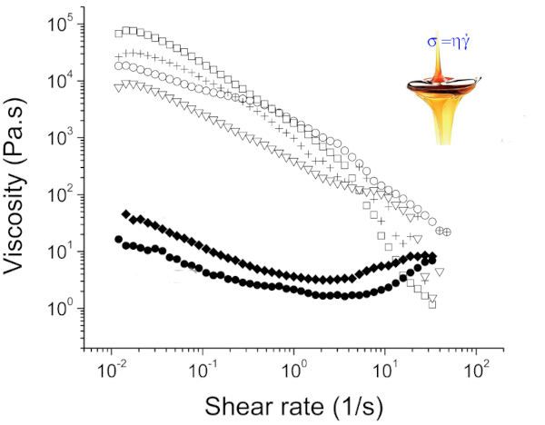

# Flow curve fitter

Software that fits rheological models to viscometer measurements of stress vs. strain rate. Code is written in Python language. 

## 1. Background
Shear viscosity is an important measurement technique for several industries: food, chemicals, concrete are common examples.
To quantify the material properties several models have been developed, from a simple power law to more complex equations that are virtually impossible to insert into common spreadsheets software. This software makes the above task intuitive, fast and easy. 

## 2. The data
Synthetic data representative of a shear thinning fluid such as mayonnaise or chocolate spread.

Only two columns (features), shear strain rate and shear stress, are given as input in the file "input_data.csv". To fit your data simply update the file pasting the corresponding values from your measurement.

You obtain and Excel file as output. It contains a sheet with experimental and calculated data from each fit, and a sheet with constants calculated values and model scores.

## 3. The models 

    • Ostwald – de Waele power law
      
    • Carreau
      
    • Carreau-Yasuda
      
    • Cross
        
    • Bingham
       
    • Herschel-Bulkley
       
    • Casson

Details for each can be easily found online. Equation are written into decorators and fitted to the experimental values using the Scikit-Learn curve-fitting package.

The whole code can be found in the [following Jupyter notebook](https://github.com/opsabarsec/flow-curve-fitter/blob/master/Flow_curves_models_fit.ipynb)

Data from a selected model are presented as experimental fit and plotted with Matplotlib. 

## 4. Conclusions 
- Open the file "input_data.csv" and paste the values of strain rate and stress you would like to model. Several theoretical models are quickly fitted to experimental data. Constant and curvefits are calculated for each.

- You can get all results in a convenient format so that can be further analysed with any spreadsheet software. Output file is named at your wish using a simple input-name function in the code. 
